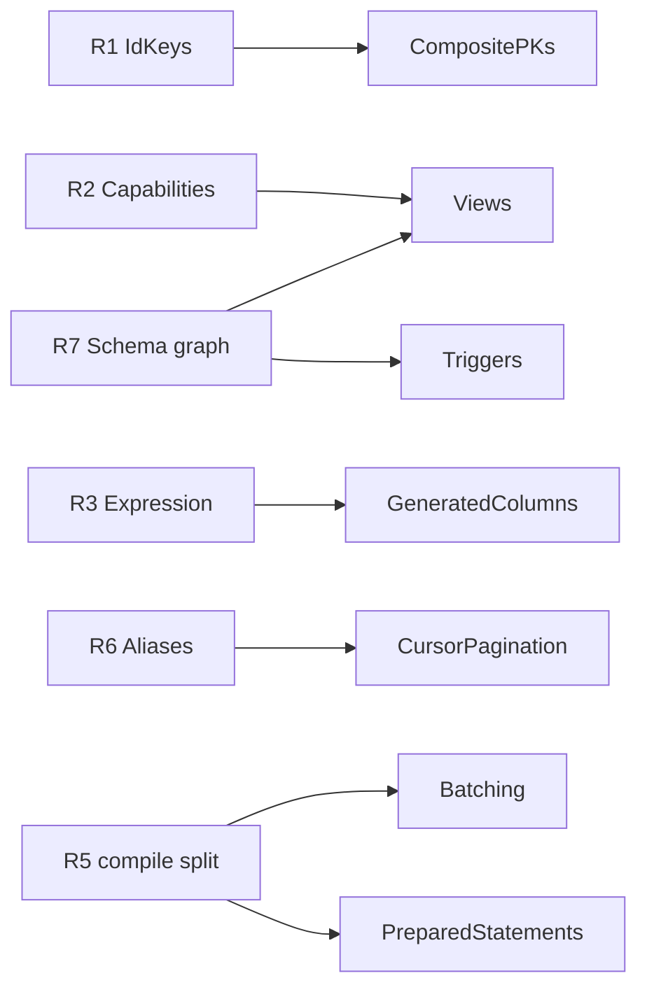

# Roadmap

Next feature block, in the order it should be built. Groundwork first, so the features that
depend on it stay small.

## Foundational refactors

| #   | Refactor                                                  | Unlocks                                      | State      |
| :-- | :-------------------------------------------------------- | :------------------------------------------- | :--------- |
| R1  | `IdKeys<E>`: an entity has _zero or more_ key columns     | composite PKs, views                         | to do      |
| R2  | Entity capabilities (`readable`/`writable`/`refreshable`) | views, matviews, future CTEs                 | to do      |
| R3  | One expression type wherever SQL is accepted              | checks, generated columns, views, windows    | **0.40.0** |
| R4  | `raw` is a tagged template                                | R3's ergonomics, injection safety            | **0.40.0** |
| R5  | `dialect.compile(query) -> { sql, values }`               | prepared statements, batching                | to do      |
| R6  | One projection-alias concept for derived result keys      | `$window`, cursor metadata, `$agg`, `_count` | to do      |
| R7  | Schema objects as a dependency-ordered graph              | enums, views, triggers                       | step 1     |

**R1.** `IdKey<E>` assumes one key. It becomes `IdKeys<E>`, a union; `IdValue<E>` stays a scalar for
one key and becomes an object for several. Every `*ById` already takes `IdValue<E>`, so no signature
changes. Zero keys is the view case.

**R2.** `@Entity` means "table". A capability set (`readable`/`writable`/`refreshable`) makes a
read-only relation expressible and brands it on the type, so writing to a view is a compile error.

**R5.** Naming `compile(query) -> { sql, values }` makes the SQL text a memoizable identity. That is
the whole prerequisite for prepared statements and batching.

**R6.** `$agg` aliases, `_count`, and the proposed `$window` aliases and cursor metadata each carry
their own result-type derivation. Unify, or `$window` adds a third.

**R7.** Step 1 done: the table-only topological sort is now `schema/dependencyGraph.ts`
(`createOrder`, `dropOrder`, `findCycles`), generic over any node and an edge function. Cycle
tolerance is deliberate - a cyclic FK is legal SQL, handled by deferring the constraint. Left: a
`SchemaObject` vocabulary, and flattening `SchemaDiffResult`, which carries one field per kind. Both
wait for a second kind, so the shape is derived rather than guessed.

---

## Composite primary keys

```ts
@Id({ type: Number }) userId?: number;
@Id({ type: Number }) groupId?: number;

await pool.deleteOneById(Membership, { userId: 1, groupId: 2 });
```

**Everything that can address a row by several columns works**: declaration, DDL, inserts, by-id addressing, relation loading, relation filtering, `$count`, and the settled set a paged write names its rows by. Cascading a delete does too, by an OR of key maps where a single key is one `IN`. What is left is the places that identify a row through a single slot - the id an insert returns, the id `saveMany` reads as proof a row exists, one `_id`, one URL segment - which a composite row does not fit. Each throws naming itself rather than falling back to the first key column, so the feature fails loudly where it is unfinished instead of quietly addressing the wrong rows.

**The id is a plain object**, as TypeORM and MikroORM take. Prisma's named compound
(`where: { userId_groupId: {...} }`) exists to say _which_ unique constraint `findUnique` should use;
`findOneById` is unambiguous, so the convention would buy nothing and break on a rename. A tuple is
positionally fragile. The object also _is_ a `$where` map, so `buildQueryWhereAsMap` needs no special
case, and a list of them is the OR that `QueryWhereArray` always claimed to be.

### Where we already beat them

- **No reachable singular key.** TypeORM keeps `primaryColumns[0]`, MikroORM keeps `compositePK`
  beside the list; either lets a caller silently take the first of two. `assertSoleId` is the only
  way past `meta.ids`, and it throws.
- **Every key is required.** TypeORM's `ensureEntityIdMap` passes any object through, so
  `{ userId: 1 }` on a two-key entity addresses every row sharing it. `assertIdValue` refuses - and
  refuses `{}` on a single key too, which is otherwise a statement with no `WHERE`.
- **Refusals name the path**, rather than a generic "composite not supported".

### Left, in order

1. **The id an insert reports.** The statement needs nothing: every column of a composite comes from
   the caller, so `insertMany` inserts and reports `undefined` per row - the same "no id to give" its
   contract already carries for a key MySQL's header cannot speak for. Reporting the id itself means
   returning the map `EntityId` describes (TypeORM's `getEntityIdMixedMap`), which widens `insertOne`'s
   _return_ type for **every** entity: measured at 139 errors across this repo alone, all of them
   single-key code doing `const id = await insertOne(User, u)`. Not worth it for the composite case;
   revisit only with a way to keep the single-key return narrow.
2. **`saveMany`** - it reads an id as proof the row exists and inserts the rest. A composite is
   supplied whole on an insert too, so every row would look like an update and a new one would
   silently update nothing. Telling them apart takes a read, which is upsert's job.
3. **Saving a relation** - `saveToMany`/`saveOneToOne` write the parent's key into one child column,
   the same value for the whole page. A composite writes several columns per parent, which is a
   statement per parent rather than one over a list. Cascading a delete already takes every column,
   through `childrenOf`.
4. **MongoDB** - a compound `_id` is a sub-document, whose field order decides equality: a different
   document shape rather than a translation. Refused on both sides today, because refusing only reads
   would let a write store the columns flat where no read would look for them.
5. **The HTTP `/:id` route** - one path segment. No ORM above ships an HTTP layer, so the
   serialization is ours to invent; client and server both refuse until it is. Two things to settle
   first, in this order:
   - **The adapters disagree about percent-decoding.** `fetchHandler` splits `url.pathname`, which is
     still encoded; express hands over `req.params`, which is decoded. Invisible while ids are numbers
     and uuids, load-bearing the moment a segment carries punctuation. Normalize that first, or the
     payload has to avoid `%`, `{` and `/` altogether (base64url of the JSON).
   - **A by-id route does not check the id.** `buildIdQuery` builds a `$where` and the handler calls
     `findOne`/`updateMany`/`deleteMany`, so `assertIdValue` never runs. Harmless while the segment is
     one value, but a partial composite arriving there would address every row agreeing on the columns
     it did name - and on a `DELETE`. The check moves into `buildIdQuery` as part of this.

   Then the format itself: JSON, since that is already the wire everywhere else here. The client
   encodes an id object with `JSON.stringify`; `buildIdQuery` parses iff `meta.ids.length > 1`, so the
   shape is decided by metadata rather than by sniffing the string - an id that merely starts with `{`
   stays unambiguous. JSON also keeps `1` a number, where a delimiter-joined segment (`1~maths`) hands
   every part back as a string and breaks on a value containing the delimiter.

Types stay permissive for composites: accumulating `@Id` across properties into the class type is not
something TypeScript can do, so the `idKey` brand remains the opt-in for compile-time enforcement and
`assertIdValue` is the guarantee everyone else gets.

## Views and materialized views

```ts
export const WorkspaceUsage = defineView({
  name: 'WorkspaceUsage',
  materialized: true,
  from: () => Resource,
  query: { $group: { workspaceId: true }, $agg: { total: { $count: '*' } } },
});
```

Depends on R2, R7. A view is an entity, just read-only - which dissolves the "relation with no
entity" problem that makes CTEs a poor fit. Field types fall out of `QueryAggregateResult`, so
nothing is restated; writes are a compile error; the definition is the migration, instead of raw SQL
hidden in a migration file. `REFRESH ... CONCURRENTLY` on Postgres/CockroachDB, refused elsewhere
rather than silently downgraded.

## Generated stored columns

```ts
@Field({ type: String, virtual: raw`...`, stored: true }) fullName?: string;
```

One flag on the existing option. `$where`/`$sort`/`$select` behave identically either way; `stored`
trades disk for a real, **indexable** column, so it is a dial you flip after profiling without
touching a call site. Drizzle makes these two unrelated APIs. Postgres 12+, MySQL 5.7+, MariaDB
5.2+, SQLite 3.31+; Mongo refuses.

## Cursor pagination

```ts
await pool.findManyPage(Order, { $sort: { createdAt: -1, id: -1 }, $limit: 50, $after: cursor });
```

Depends on R6. A row-value comparison where available, an OR-chain elsewhere, a compound `$lt` on
Mongo. **Throw when the sort is not total** (last key not a primary or unique key): a keyset page
that silently skips or repeats rows under concurrent writes is worse than an error, and fail-closed
matches how `security` filters behave.

## Triggers

Variability maintains ~20 counter columns via trigger functions written as raw SQL in migrations,
invisible to `uql-migrate` diff and drift. Depends on R7. Make them **visible to the diff** first so
drift is reported, before making them authorable.

---

## Batching

```ts
const [users, total] = await pool.batch((q) => [q.findMany(User, { $limit: 10 }), q.count(User)]);
```

Depends on R5. One round trip on D1, libSQL/Turso and Neon HTTP; `BEGIN`/`COMMIT` and N round trips
on `pg`, `mysql2`, `mariadb` - correct, not faster.

**The entity-level API cannot keep its promise.** Most querier methods are not one statement:
`findMany` issues extra queries for to-many relations, `$count` tallies and `$candidates` tuning;
`updateMany` and `deleteMany` run lifecycle hooks - arbitrary user code that may itself query - and
deletes cascade. Only `count`, `exists` and the inserts are reliably single. A caller cannot tell
which from the call site: add `$populate` of a to-many and a "batch" quietly becomes several round
trips, or throws at run time.

So the honest shape is statement-level - `pool.batch([{ sql, values }, ...])` over `compile()` -
which guarantees the round trip but gives up the typing that makes the rest of the API worth using.
Decide which of those is wanted before building either.

## Server-side prepared statements

Opt-in per pool, **default off**: session-level prepared statements break transaction-mode poolers,
which is currently advertised as a feature. Depends on R5 - the same query shape compiles to a
byte-identical string, so that string is the cache key with no fingerprinting. `IN`-list arity and
`insertMany` chunking would thrash the cache; cap it and skip variadic statements.

## Dependencies



## Shipped

**Enum fields** and **check constraints** landed in 0.41.1; `raw` as a tagged template and the one
expression type in 0.40.0. Two decisions from those worth not re-litigating:

- **A check is never diffed.** It is SQL text, and a database reprints text from its parse tree, so a
  diff could only match names - and only PostgreSQL reports checks at all. A check is created with its
  table; changing one is a hand-written migration. The sync path was built and reverted.
- **An enum is a column check, not a native type.** `CREATE TYPE` is a second schema object needing
  its own ordering, and Postgres's `ALTER TYPE ... ADD VALUE` is irreversible while removing a value
  rewrites every dependent column. A column check makes adding a value an ordinary column change.
