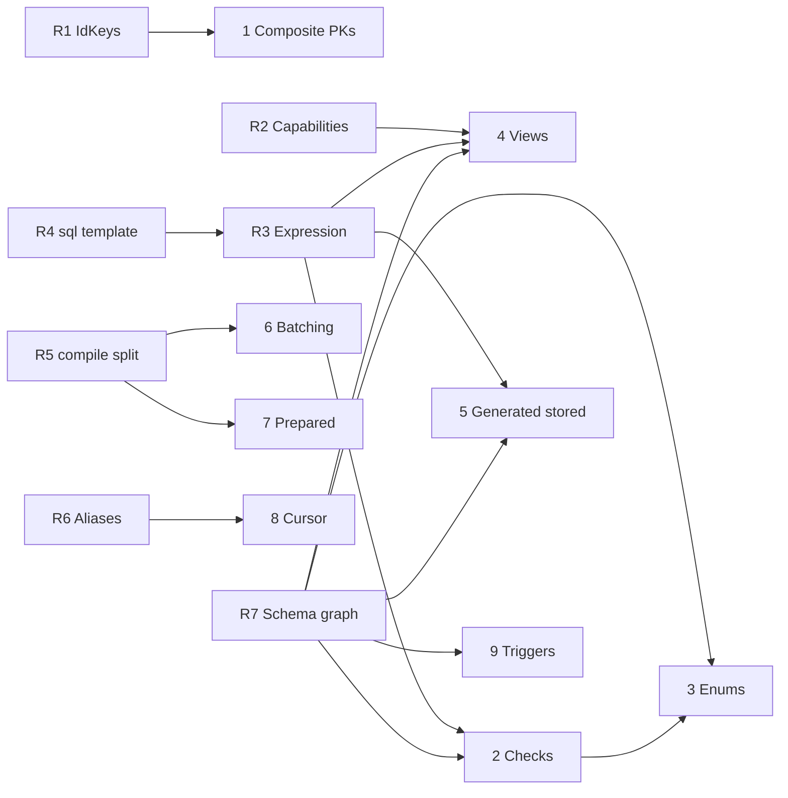

# Roadmap

Draft plan for the next feature block. Ordered so that shared groundwork lands before the
features that depend on it.

## 0. Foundational refactors

Every feature below is cheaper, and the resulting API smaller, if these land first. Each one
collapses several bespoke code paths that would otherwise be written once per feature.

| #   | Refactor                                                          | Unlocks                                                    |
| :-- | :---------------------------------------------------------------- | :--------------------------------------------------------- |
| R1  | `IdKeys<E>`: an entity has _zero or more_ key columns             | composite PKs, views                                       |
| R2  | Entity capabilities (`readable`/`writable`/`keyed`/`refreshable`) | views, matviews, future CTEs                               |
| R3  | One `Expression` type wherever SQL is accepted                    | checks, generated columns, views, partial indexes, windows |
| R4  | `sql` tagged template as the primary `raw` surface                | R3's ergonomics, injection safety                          |
| R5  | `dialect.compile(query) -> { sql, values }`                       | prepared statements, batching                              |
| R6  | One projection-alias concept for derived result keys              | `$window`, cursor metadata, `$agg`, `_count`               |
| R7  | Schema objects as a typed, dependency-ordered graph               | checks, enums, views, triggers, sequences                  |

### R1. Key identity becomes plural

`IdKey<E>` resolves through the `idKey` brand and assumes exactly one. It becomes `IdKeys<E>`,
a union; `IdValue<E>` stays a scalar for a single key and becomes `{ [K in IdKeys<E>]: E[K] }`
for several. Every `*ById` method already takes `IdValue<E>`, so no signature changes and no
existing entity behaves differently. Zero keys is the view case.

### R2. Entity capabilities

`@Entity` means "table" today. Generalize the metadata to a capability set so a read-only
relation is expressible:

| Kind              | readable | writable |  keyed   | refreshable |
| :---------------- | :------: | :------: | :------: | :---------: |
| table             |   yes    |   yes    |   yes    |     no      |
| view              |   yes    |    no    | optional |     no      |
| materialized view |   yes    |    no    | optional |     yes     |

Branded on the entity type, so `pool.insertOne(SomeView, ...)` is a compile error rather than a
database error. This is also the extension point that would let CTEs in later without a second
redesign.

### R3. One expression type (done, 0.40.0)

SQL fragments entered through unrelated doors: `@Field({ virtual })`, `raw()` in
`$select`/`$where`/update payloads, and `IndexOptions.where`, which was a bare **string**.

`where` now takes a `QueryRaw` like everything else, normalized in `defineIndex` alongside the
columns it already normalized, and in the two migration-builder paths. The bare string still works.

The rule that fell out, and that checks and generated columns inherit: **DDL takes `raw` with no
interpolation.** `CREATE INDEX` has no placeholder to bind a value into, so a predicate carrying one
is refused rather than emitted. That is the same check an index expression already made, now shared:

```ts
@Index(['email'], { unique: true, where: raw`"deletedAt" IS NULL` })   // fine
@Index(['name'], { where: raw`"stock" > ${0}` })                       // throws
```

What is still outstanding under R3: nothing new accepts SQL yet, so the next expression sites
(checks, `stored` generated columns, view bodies) simply reuse `QueryRaw` and this same rule.

### R4. `raw` becomes a tagged template (done, 0.40.0)

`QueryContext` exposes `append` / `addValue` / `pushValue`: imperative, and the safe path was the
verbose one. The docs made the case, naming a `ctx.value()` that never existed.

Rather than add a spelling, `raw` itself is the tag. Two interpolation rules, no more:

```ts
raw`"stock" - ${quantity}`; // a value is bound
raw`CONCAT(${col('firstName')}, ' ', ${col('lastName')})`; // a QueryRaw resolves in place
raw`LOG10(${points})`.as('score'); // .as() replaces the alias argument
```

`raw('sql')` is deprecated and `uql-codemod` rewrites it. The callback stays for SQL a template
cannot express (a sub-query through `dialect.find(...)`).

Three things the implementation settled that the plan had wrong:

- **A bare function interpolation is untypeable.** A template whose values are `unknown` gives an
  interpolated arrow no contextual type, so `({ escapedPrefix }) => ...` is an implicit `any`. Rule
  dropped; `col()` and an interpolated `raw(cb)` cover it with full inference.
- **A zero-interpolation tag degrades to the string form.** DDL paths read an index expression back
  as text, and a function has no text. `` raw`x` `` and `raw('x')` are now the same object.
- **`escapedPrefix` already carries its trailing dot.** Two published examples wrote
  `${escapedPrefix}.col` and emitted `` `T`..col ``. `col()` exists so that detail stops being the
  reader's problem.

### R5. Split compile from execute

Formalize `dialect.compile(query) -> { sql, values }`. UQL effectively does this already; naming
it makes the SQL text a stable, memoizable identity. That is the whole prerequisite for prepared
statements and for batching, and later for normalizing `IN`-list arity.

### R6. One projection-alias concept

`$agg` aliases, `_count`, proposed `$window` aliases and cursor metadata each carry their own
result-type derivation. Unify to one, or `$window` adds a third parallel implementation of the
same idea.

### R7. Schema objects as a graph (in progress)

The migration model is tables, columns, indexes, foreign keys. Checks, enum types, views, matviews,
triggers and sequences all need to be diffed and ordered.

**What the code already had, which the plan missed:** dependency ordering exists. `SchemaAST`
topologically sorts tables by their foreign keys for `CREATE`, reverses it for `DROP`, and walks the
same edges again to report cycles. It was simply hard-wired to `TableNode`.

**Step 1 (done).** That machinery is now `schema/dependencyGraph.ts`: `createOrder`, `dropOrder`,
`findCycles`, generic over any node and an edge function. `SchemaAST` is three one-line calls into
it, behaviour unchanged, and the two duplicated DFS walks are one each. A new kind of schema object
joins the ordering by describing its edges rather than by adding a branch.

Cycle tolerance is the property worth preserving deliberately: a cyclic foreign key is legal SQL,
handled by deferring the constraint, so `createOrder` orders a cycle rather than refusing it and
`findCycles` is a separate walk for when a cycle needs reporting.

**Step 2.** A `SchemaObject` vocabulary - `kind`, qualified `name`, `dependsOn` - so an enum type can
say it precedes the column typed by it and a view can say it follows the tables it selects from.
Deliberately not built yet: with no second kind of object to order, it would be a shape guessed
rather than derived. It lands with checks, the first kind that needs it.

**Step 3.** Flatten `SchemaDiffResult` onto it. Today it carries one field per object kind
(`tablesToCreate`, `columnDiffs`, `indexDiffs`, `relationshipDiffs`), so each new kind is another
field plus a branch in every consumer, and DDL order is implicit in the order those fields are read.

---

## 1. Composite primary keys

```ts
@Entity()
export class TranscriptChunkCaption {
  @Id({ type: String }) transcriptChunkId?: UUID;
  @Id({ type: String }) captionId?: UUID;
}

await pool.deleteOneById(TranscriptChunkCaption, { transcriptChunkId, captionId });
```

**Depends on:** R1.

`TableDefinition.primaryKey?: string[]` already exists in the builder, so DDL emission is nearly
free. The real work is relations: `references: () => Entity` resolves to a single column, so
`ReferenceOptions` and `mappedBy` must carry a column list. Concentrate tests there.

Reject composite + auto-increment at registration: MySQL's `insertMany` id inference cannot
serve it, and composite keys are natural keys in practice, so nothing real is lost.

The only outright blocker on this list. Both Prisma and Drizzle handle it; UQL currently cannot
map a join table or a legacy schema keyed on two columns.

## 2. Check constraints

```ts
@Entity({ checks: [{ name: 'credits_non_negative', expression: raw(({ sql }) => sql`"creditsBalance" >= 0`) }] })

@Field({ type: Number, check: raw(({ sql }) => sql`"amount" > 0`) }) amount?: number;
```

**Depends on:** R3, R7. **Blocks:** feature 3.

Named constraints, so diffing is name-based exactly like indexes. PostgreSQL, CockroachDB,
MySQL 8.0.16+, MariaDB, SQLite. SQLite only accepts them at `CREATE TABLE`, so adding one later
is a table rebuild the migrator must emit. MongoDB refuses rather than silently ignoring, matching
how unsupported vector metrics are handled.

Drizzle-parity, not intersection: Prisma has never shipped these. Ship them for what they unblock.

## 3. Native enums

```ts
@Field({ type: String, enum: ['draft', 'paid', 'void'] as const })
status?: 'draft' | 'paid' | 'void';
```

**Depends on:** 2, R7.

The `as const` array and the TS union check against each other, so a drift between them is a
compile error.

| Engine                  | Emission                         |
| :---------------------- | :------------------------------- |
| PostgreSQL, CockroachDB | `CREATE TYPE … AS ENUM`          |
| MySQL, MariaDB          | native `ENUM(...)` column        |
| SQLite                  | `CHECK (col IN (...))`           |
| MongoDB                 | `$jsonSchema` validator, or skip |

**The migration behaviour is where this is won.** Adding a value is a cheap, irreversible
`ALTER TYPE … ADD VALUE`; removing one requires recreating the type and rewriting every dependent
column. That asymmetry is the main complaint against both competitors' enum handling. UQL already
has the right default to lean on: additive changes apply, the destructive rebuild is refused under
`uql-migrate sync` without `--unsafe`.

## 4. Views and materialized views

```ts
export const WorkspaceUsage = defineView({
  name: 'WorkspaceUsage',
  materialized: true,
  from: () => Resource,
  query: { $group: { workspaceId: true }, $agg: { total: { $count: '*' } } },
});

await pool.findMany(WorkspaceUsage, { $where: { total: { $gt: 10 } } });
await pool.refreshView(WorkspaceUsage, { concurrently: true });
```

**Depends on:** R2, R3, R7.

A view is an entity, just read-only. That framing dissolves the "relation with no entity" problem
that makes generic CTEs a poor fit for UQL's model, and leaves the door open for them later.

Three properties worth designing for:

- **Field types are derived, not restated.** `QueryAggregateResult` already computes the row type
  of that aggregate, so the view's shape falls out of its definition. Nothing to keep in sync.
- **Read-only at the type level** via R2, so a write is a compile error.
- **The definition is the migration.** The schema generator emits `CREATE VIEW` and diffs it,
  instead of the view living as invisible raw SQL in a migration file.

Materialized views on PostgreSQL and CockroachDB with `REFRESH … CONCURRENTLY`; plain views
elsewhere, with `materialized: true` refused rather than silently downgraded.

## 5. Generated stored columns

No new concept: one flag on the existing one.

```ts
@Field({ type: String, virtual: raw(...), stored: true }) fullName?: string;
```

**Depends on:** R3, R7.

|           | `virtual` today              | `virtual` + `stored`             |
| :-------- | :--------------------------- | :------------------------------- |
| Migration | none                         | `GENERATED ALWAYS AS (…) STORED` |
| Cost      | recomputed per row per query | disk, written once               |
| Indexable | no                           | **yes**                          |

`$where`, `$sort` and `$select` behave identically either way; the planner stops inlining and
selects the column. So `stored` is a pure performance dial, flippable after profiling without
touching a call site. Drizzle makes these two unrelated APIs you must choose between upfront.

PostgreSQL 12+, MySQL 5.7+, MariaDB 5.2+, SQLite 3.31+. MongoDB refuses at registration.

## 6. Batching

```ts
const [users, total] = await pool.batch((q) => [
  q.findMany(User, { $where: { active: true }, $limit: 10 }),
  q.count(User),
]);
```

**Depends on:** R5.

`q` is a recording querier returning lazy descriptors, so variadic tuple types give exact
per-element result types.

| Driver                      | Behaviour                                              |
| :-------------------------- | :----------------------------------------------------- |
| Cloudflare D1, libSQL/Turso | native `batch()`: one round trip, implicit transaction |
| Neon HTTP                   | array-of-queries transaction: one round trip           |
| `pg`, `mysql2`, `mariadb`   | `BEGIN`/`COMMIT`, N round trips. Correct, not faster   |
| MongoDB                     | bulk write where the ops allow, else sequential        |

Uniform API, real speedup where round trips are HTTP requests. That is the edge story, and the
one place a batching API pays for itself rather than being sugar. D1's driver interface already
declares `batch`; nothing public reaches it.

## 7. Server-side prepared statements

**Opt-in, per pool, default off**, because session-level prepared statements break under
transaction-mode poolers, which is a property currently advertised as a feature.

```ts
new PgQuerierPool({ connectionString, prepare: true });
await pool.findMany(User, { … }, { prepare: true });
```

**Depends on:** R5.

Because UQL compiles a query object into SQL with bound parameters, the same shape with different
values yields a byte-identical string. That string is the cache key, with no fingerprinting pass.
LRU of SQL text to driver statement name, then `pg`'s `{ name, text, values }`, `mysql2`'s
`execute()`, `better-sqlite3`'s own cache.

`IN`-list arity and `insertMany` chunking generate a distinct string per size and would thrash the
cache: cap it, and skip preparation for variadic statements until R5 can normalize placeholder
counts. Fixed-shape reads, which is most of them, get the full benefit.

## 8. Cursor pagination

```ts
const page = await pool.findManyPage(Order, {
  $where: { status: 'paid' },
  $sort: { createdAt: -1, id: -1 },
  $limit: 50,
  $after: previous.cursor,
});
```

**Depends on:** R6 (cursor metadata as a projection alias).

Emits a row-value comparison, `WHERE ("createdAt", "id") < ($1, $2)`, on PostgreSQL, CockroachDB,
MySQL 8, MariaDB and SQLite; an expanded OR-chain where unavailable; a compound `$lt` on MongoDB.
The cursor encodes the last row's sort-key values, base64'd: opaque so the shape can change,
URL-safe so it crosses a query string and the browser querier.

**The decision that makes it safe:** a keyset page is correct only if the sort is total. Verify at
build time that the final `$sort` key is the primary key or a unique-indexed field, and **throw**
otherwise. Emitting a query that silently skips or repeats rows under concurrent writes is worse
than an error, and fail-closed matches how `security` filters already behave.

## 9. Triggers

Found in the field, not on the original list. Variability maintains ~20 denormalized counter
columns via `app_sync_entity_count()` triggers written as raw SQL across three migrations. UQL's
schema model has no concept of them, so `uql-migrate` diff and drift detection are blind to a
piece of schema that data correctness depends on.

**Depends on:** R7 (a trigger depends on its function and its table: exactly the `dependsOn` edge).

Minimum viable version is declarative registration plus diffing, not a DSL for the body:

```ts
@Entity({ triggers: [{ name: 'sync_counts', on: ['insert', 'delete'], timing: 'after',
                       function: 'app_sync_entity_count' }] })
```

PostgreSQL and CockroachDB reference a function; MySQL/MariaDB and SQLite inline the body. Start
by making them **visible to the diff** so drift is reported, before making them authorable.

---

## Dependencies



## Suggested order

1. **R7, R3, R4** together: the schema graph, one expression type, and the `sql` template. Nothing
   ships to users, and everything after gets cheaper.
2. **Composite PKs** (R1). Unblocks real schemas; type changes are additive.
3. **Batching** (R5). Defends the edge differentiator.
4. **Checks**, then **native enums**.
5. **Views / materialized views** (R2).
6. **Generated stored columns**, **cursor pagination**, **triggers (diff-visible)**.
7. **Prepared statements** last: the narrowest benefit and the most driver-specific risk.

`$window` / `$whereWindow` sits outside this list but is the single feature that would let real
applications delete their remaining hand-written CTE queries. It depends on R6. Slot it after
step 4 if the window-function gap starts costing adoption.

## Immediate fixes

- ~~`ctx.value()` does not exist~~. Fixed: the docs now name `ctx.addValue()`, and R4 removes the
  reason to reach for it. The `raw` tag itself is undocumented until the next release, since the
  site's `check.docs` compiles every fence against the published `uql-orm`.
- `IndexOptions.where` takes a raw string while every comparable option takes a `QueryRaw`.
  Fold it into R3.
