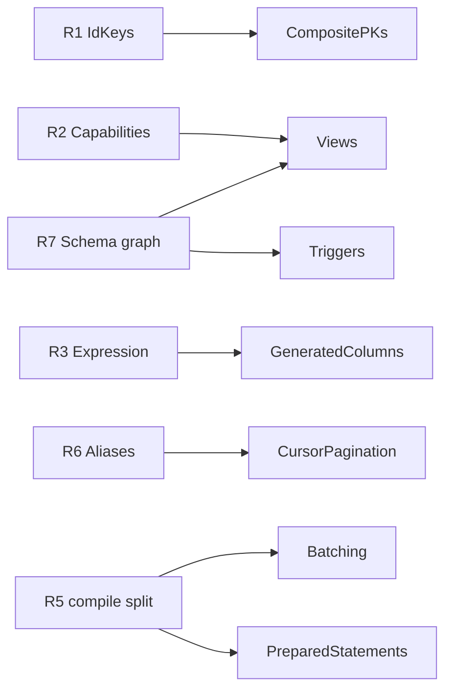

# Roadmap

Next feature block, in the order it should be built. Groundwork first, so the features that
depend on it stay small.

## Foundational refactors

| #   | Refactor                                                  | Unlocks                                      | State      |
| :-- | :-------------------------------------------------------- | :------------------------------------------- | :--------- |
| R1  | `IdKeys<E>`: an entity has _zero or more_ key columns     | composite PKs, views                         | to do      |
| R2  | Entity capabilities (`readable`/`writable`/`refreshable`) | views, matviews, future CTEs                 | to do      |
| R3  | One expression type wherever SQL is accepted              | checks, generated columns, views, windows    | **0.40.0** |
| R4  | `raw` is a tagged template                                | R3's ergonomics, injection safety            | **0.40.0** |
| R5  | `dialect.compile(query) -> { sql, values }`               | prepared statements, batching                | to do      |
| R6  | One projection-alias concept for derived result keys      | `$window`, cursor metadata, `$agg`, `_count` | to do      |
| R7  | Schema objects as a dependency-ordered graph              | enums, views, triggers                       | step 1     |

**R1.** `IdKey<E>` assumes one key. It becomes `IdKeys<E>`, a union; `IdValue<E>` stays a scalar for
one key and becomes an object for several. Every `*ById` already takes `IdValue<E>`, so no signature
changes. Zero keys is the view case.

**R2.** `@Entity` means "table". A capability set (`readable`/`writable`/`refreshable`) makes a
read-only relation expressible and brands it on the type, so writing to a view is a compile error.

**R5.** Naming `compile(query) -> { sql, values }` makes the SQL text a memoizable identity. That is
the whole prerequisite for prepared statements and batching.

**R6.** `$agg` aliases, `_count`, and the proposed `$window` aliases and cursor metadata each carry
their own result-type derivation. Unify, or `$window` adds a third.

**R7.** Step 1 done: the table-only topological sort is now `schema/dependencyGraph.ts`
(`createOrder`, `dropOrder`, `findCycles`), generic over any node and an edge function. Cycle
tolerance is deliberate - a cyclic FK is legal SQL, handled by deferring the constraint. Left: a
`SchemaObject` vocabulary, and flattening `SchemaDiffResult`, which carries one field per kind. Both
wait for a second kind, so the shape is derived rather than guessed.

---

## Composite primary keys

```ts
@Id({ type: Number }) userId?: number;
@Id({ type: Number }) groupId?: number;

await pool.deleteOneById(Membership, { userId: 1, groupId: 2 });
```

**Done:** `meta.ids` as the only stored form, `@Id` twice declaring a composite, composite
`PRIMARY KEY` DDL, by-id `$where`, and a refusal naming its own path everywhere composites are not
supported yet.

**The id is a plain object**, as TypeORM and MikroORM take. Prisma's named compound
(`where: { userId_groupId: {...} }`) exists to say _which_ unique constraint `findUnique` should use;
`findOneById` is unambiguous, so the convention would buy nothing and break on a rename. A tuple is
positionally fragile. The object also _is_ a `$where` map, so `buildQueryWhereAsMap` needs no special
case.

### Where we already beat them

- **No reachable singular key.** TypeORM keeps `primaryColumns[0]`, MikroORM keeps `compositePK`
  beside the list; either lets a caller silently take the first of two.
- **Every key is required.** TypeORM's `ensureEntityIdMap` passes any object through, so
  `{ userId: 1 }` on a two-key entity addresses every row sharing it. `assertIdValue` refuses.
- **Refusals name the path**, rather than a generic "composite not supported".

### Left, in order

Every path below refuses a composite by name rather than guessing, so the feature is inert where it is unfinished rather than wrong.

1. **Relation filtering** (`abstractSqlDialect`, 4 sites) - the correlated `EXISTS`/`IN` sub-query
   correlates on one column (`t.a = p.a`) and reads a junction's pairs positionally. A composite needs every key anded, and the pair groups sliced at the parent's key count as `parentKeyColumns` does.
2. **`insertMany` id return** - `RETURNING <col> AS id` names one column. A composite returns the map `EntityId` already describes, which is TypeORM's `getEntityIdMixedMap`.
3. **`$count` tallies** - groups per parent by one column; needs `rowKey` as the loaders now use it.
4. **MongoDB** - a compound `_id` is a different document shape, not a translation.
5. **The HTTP `/:id` route** - one path segment. No ORM above ships an HTTP layer, so the serialization is ours to invent.

Done since: `meta.ids` as the only stored form, composite `PRIMARY KEY` and foreign-key DDL with each column typed from its own referenced key, by-id addressing through `EntityId`, `assertIdValue` requiring every key, one-to-many loading, and every key column surviving a projection so children
group correctly.

Types stay permissive for composites: accumulating `@Id` across properties into the class type is not
something TypeScript can do, so the `idKey` brand remains the opt-in for compile-time enforcement and
`assertIdValue` is the guarantee everyone else gets.

## Views and materialized views

```ts
export const WorkspaceUsage = defineView({
  name: 'WorkspaceUsage',
  materialized: true,
  from: () => Resource,
  query: { $group: { workspaceId: true }, $agg: { total: { $count: '*' } } },
});
```

Depends on R2, R7. A view is an entity, just read-only - which dissolves the "relation with no
entity" problem that makes CTEs a poor fit. Field types fall out of `QueryAggregateResult`, so
nothing is restated; writes are a compile error; the definition is the migration, instead of raw SQL
hidden in a migration file. `REFRESH ... CONCURRENTLY` on Postgres/CockroachDB, refused elsewhere
rather than silently downgraded.

## Generated stored columns

```ts
@Field({ type: String, virtual: raw`...`, stored: true }) fullName?: string;
```

One flag on the existing option. `$where`/`$sort`/`$select` behave identically either way; `stored`
trades disk for a real, **indexable** column, so it is a dial you flip after profiling without
touching a call site. Drizzle makes these two unrelated APIs. Postgres 12+, MySQL 5.7+, MariaDB
5.2+, SQLite 3.31+; Mongo refuses.

## Cursor pagination

```ts
await pool.findManyPage(Order, { $sort: { createdAt: -1, id: -1 }, $limit: 50, $after: cursor });
```

Depends on R6. A row-value comparison where available, an OR-chain elsewhere, a compound `$lt` on
Mongo. **Throw when the sort is not total** (last key not a primary or unique key): a keyset page
that silently skips or repeats rows under concurrent writes is worse than an error, and fail-closed
matches how `security` filters behave.

## Triggers

Variability maintains ~20 counter columns via trigger functions written as raw SQL in migrations,
invisible to `uql-migrate` diff and drift. Depends on R7. Make them **visible to the diff** first so
drift is reported, before making them authorable.

---

## Batching

```ts
const [users, total] = await pool.batch((q) => [q.findMany(User, { $limit: 10 }), q.count(User)]);
```

Depends on R5. One round trip on D1, libSQL/Turso and Neon HTTP; `BEGIN`/`COMMIT` and N round trips
on `pg`, `mysql2`, `mariadb` - correct, not faster.

**The entity-level API cannot keep its promise.** Most querier methods are not one statement:
`findMany` issues extra queries for to-many relations, `$count` tallies and `$candidates` tuning;
`updateMany` and `deleteMany` run lifecycle hooks - arbitrary user code that may itself query - and
deletes cascade. Only `count`, `exists` and the inserts are reliably single. A caller cannot tell
which from the call site: add `$populate` of a to-many and a "batch" quietly becomes several round
trips, or throws at run time.

So the honest shape is statement-level - `pool.batch([{ sql, values }, ...])` over `compile()` -
which guarantees the round trip but gives up the typing that makes the rest of the API worth using.
Decide which of those is wanted before building either.

## Server-side prepared statements

Opt-in per pool, **default off**: session-level prepared statements break transaction-mode poolers,
which is currently advertised as a feature. Depends on R5 - the same query shape compiles to a
byte-identical string, so that string is the cache key with no fingerprinting. `IN`-list arity and
`insertMany` chunking would thrash the cache; cap it and skip variadic statements.

## Dependencies



## Shipped

**Enum fields** and **check constraints** landed in 0.41.1; `raw` as a tagged template and the one
expression type in 0.40.0. Two decisions from those worth not re-litigating:

- **A check is never diffed.** It is SQL text, and a database reprints text from its parse tree, so a
  diff could only match names - and only PostgreSQL reports checks at all. A check is created with its
  table; changing one is a hand-written migration. The sync path was built and reverted.
- **An enum is a column check, not a native type.** `CREATE TYPE` is a second schema object needing
  its own ordering, and Postgres's `ALTER TYPE ... ADD VALUE` is irreversible while removing a value
  rewrites every dependent column. A column check makes adding a value an ordinary column change.
