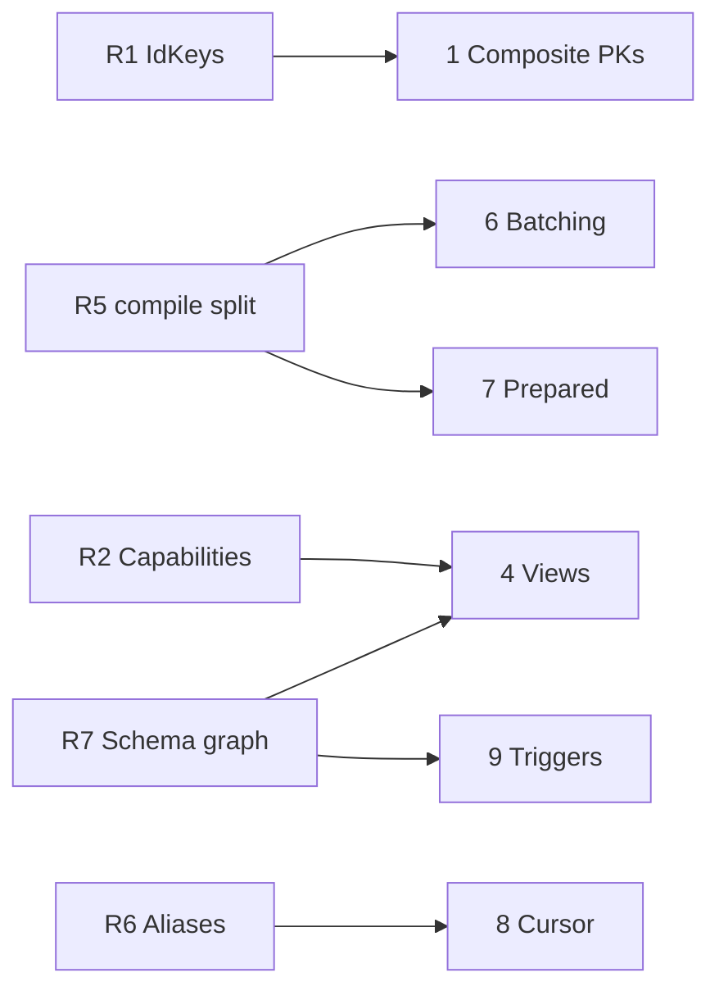

# Roadmap

Next feature block. Groundwork first, so the features that depend on it stay small.

## 0. Foundational refactors

| #   | Refactor                                                  | Unlocks                                      | State      |
| :-- | :-------------------------------------------------------- | :------------------------------------------- | :--------- |
| R1  | `IdKeys<E>`: an entity has _zero or more_ key columns     | composite PKs, views                         | to do      |
| R2  | Entity capabilities (`readable`/`writable`/`refreshable`) | views, matviews, future CTEs                 | to do      |
| R3  | One expression type wherever SQL is accepted              | checks, generated columns, views, windows    | **0.40.0** |
| R4  | `raw` is a tagged template                                | R3's ergonomics, injection safety            | **0.40.0** |
| R5  | `dialect.compile(query) -> { sql, values }`               | prepared statements, batching                | to do      |
| R6  | One projection-alias concept for derived result keys      | `$window`, cursor metadata, `$agg`, `_count` | to do      |
| R7  | Schema objects as a dependency-ordered graph              | enums, views, triggers                       | step 1     |

**R1.** `IdKey<E>` assumes one key. It becomes `IdKeys<E>`, a union; `IdValue<E>` stays a scalar for
one key and becomes an object for several. Every `*ById` already takes `IdValue<E>`, so no signature
changes. Zero keys is the view case.

**R2.** `@Entity` means "table". A capability set (`readable`/`writable`/`refreshable`) makes a
read-only relation expressible and brands it on the type, so writing to a view is a compile error.

**R5.** Naming `compile(query) -> { sql, values }` makes the SQL text a memoizable identity. That is
the whole prerequisite for prepared statements and batching.

**R6.** `$agg` aliases, `_count`, and the proposed `$window` aliases and cursor metadata each carry
their own result-type derivation. Unify, or `$window` adds a third.

**R7.** Step 1 done: the table-only topological sort is now `schema/dependencyGraph.ts`
(`createOrder`, `dropOrder`, `findCycles`), generic over any node and an edge function. Cycle
tolerance is deliberate - a cyclic FK is legal SQL, handled by deferring the constraint. Left: a
`SchemaObject` vocabulary, and flattening `SchemaDiffResult`, which carries one field per kind. Both
wait for a second kind, so the shape is derived rather than guessed.

---

## 1. Composite primary keys

```ts
@Id({ type: String }) transcriptChunkId?: UUID;
@Id({ type: String }) captionId?: UUID;
```

Depends on R1. `TableDefinition.primaryKey` already takes a list, so the DDL is nearly free; the work
is relations, where `references` resolves to a single column. Reject composite + auto-increment:
MySQL's `insertMany` id inference cannot serve it. The only outright blocker on this list.

## 2. Check constraints

```ts
@Entity({ checks: [{ expression: raw`"spent" <= "balance"` }] }) // named ck_<table>_<position>
```

**Done:** authoring through `CREATE TABLE` on every SQL dialect. A bound value is refused, per R3.

**Deliberately no diff.** A check is added with its table; changing one is a hand-written migration.
The sync path was built and reverted: a check is SQL text, and a database reprints text from its
parse tree (`CHECK ("balance" >= 0)` comes back as `CHECK ((balance >= (0)::numeric))`), so a diff
could only ever match names - and only Postgres reads them back at all, so `missingChecks` cannot
tell "none exist" from "cannot see them". Enums need none of this: SQLite lowers one to a
column-level `CHECK (col IN (...))`.

## 3. Enum fields

```ts
@Field({ type: String, enum: ['draft', 'paid', 'void'] as const })
status?: 'draft' | 'paid' | 'void';
```

**Done.** The values are typed against the field's own union, and emitted as a column
`CHECK (col IN (...))` on every SQL dialect.

Deliberately not a native enum type. `CREATE TYPE` is a second schema object needing its own
ordering, and Postgres's `ALTER TYPE ... ADD VALUE` is irreversible while removing a value recreates
the type and rewrites every dependent column - the asymmetry that draws most of the complaints
against both competitors. A column check has none of that: adding a value is an ordinary column
change. `native: true` can be an opt-in later for anyone who wants the pg type's ordering.

## 4. Views and materialized views

```ts
export const WorkspaceUsage = defineView({
  name: 'WorkspaceUsage',
  materialized: true,
  from: () => Resource,
  query: { $group: { workspaceId: true }, $agg: { total: { $count: '*' } } },
});
```

Depends on R2, R7. A view is an entity, just read-only - which dissolves the "relation with no
entity" problem that makes CTEs a poor fit. Field types fall out of `QueryAggregateResult`, so
nothing is restated; writes are a compile error; the definition is the migration, instead of raw SQL
hidden in a migration file. `REFRESH ... CONCURRENTLY` on Postgres/CockroachDB, refused elsewhere
rather than silently downgraded.

## 5. Generated stored columns

```ts
@Field({ type: String, virtual: raw`...`, stored: true }) fullName?: string;
```

One flag on the existing option. `$where`/`$sort`/`$select` behave identically either way; `stored`
trades disk for a real, **indexable** column, so it is a dial you flip after profiling without
touching a call site. Drizzle makes these two unrelated APIs. Postgres 12+, MySQL 5.7+, MariaDB
5.2+, SQLite 3.31+; Mongo refuses.

## 6. Batching

```ts
const [users, total] = await pool.batch((q) => [q.findMany(User, { $limit: 10 }), q.count(User)]);
```

Depends on R5. `q` records lazy descriptors, so variadic tuples give exact per-element types.
One round trip on D1, libSQL/Turso and Neon HTTP; `BEGIN`/`COMMIT` and N round trips on `pg`,
`mysql2`, `mariadb` - correct, not faster. The win lands exactly where round trips are HTTP
requests, which is the edge story. D1's driver already declares `batch`; nothing public reaches it.

## 7. Server-side prepared statements

Opt-in per pool, **default off**: session-level prepared statements break transaction-mode poolers,
which is currently advertised as a feature. Depends on R5 - the same query shape compiles to a
byte-identical string, so that string is the cache key with no fingerprinting. `IN`-list arity and
`insertMany` chunking would thrash the cache; cap it and skip variadic statements.

## 8. Cursor pagination

```ts
await pool.findManyPage(Order, { $sort: { createdAt: -1, id: -1 }, $limit: 50, $after: cursor });
```

Depends on R6. A row-value comparison where available, an OR-chain elsewhere, a compound `$lt` on
Mongo. **Throw when the sort is not total** (last key not a primary or unique key): a keyset page
that silently skips or repeats rows under concurrent writes is worse than an error, and fail-closed
matches how `security` filters behave.

## 9. Triggers

Variability maintains ~20 counter columns via trigger functions written as raw SQL in migrations,
invisible to `uql-migrate` diff and drift. Depends on R7. Make them **visible to the diff** first so
drift is reported, before making them authorable.

---

## Dependencies



## Order

1. **Composite PKs** (R1) - unblocks real schemas; the type changes are additive.
2. **Batching** (R5) - defends the edge differentiator.
3. **Views** (R2), then **generated stored columns**.
4. **Cursor pagination** (R6), **triggers** (diff-visible first).
5. **Prepared statements** last: narrowest benefit, most driver-specific risk.

`$window` / `$whereWindow` sits outside this list and is the one feature that would let real
applications delete their hand-written CTE queries. Depends on R6.
